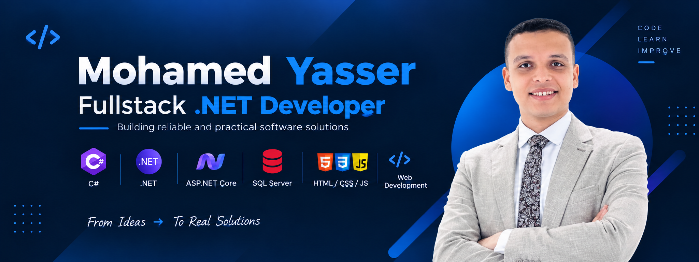

  

# Hi, I'm Mohamed Yasser 

I'm a **.NET Developer** passionate about building clean, reliable, and practical software solutions.

I mainly work with **C#, .NET, ASP.NET Core, SQL Server, and Web Development**, with a strong focus on backend development and software fundamentals.

I enjoy solving problems, learning new technologies, and turning ideas into useful applications.

---

## 🛠️ Skills & Technologies

### 💻 Programming Languages

### ⚙️ .NET & Backend

- C#
- Object-Oriented Programming (OOP)
- .NET
- ASP.NET Core
- Entity Framework Core
- LINQ
- REST APIs
- Backend Development

### 🗄️ Database

- SQL
- Database Design
- ERD
- Joins
- Stored Procedures
- Triggers
- Views
- Indexes

### 🌐 Frontend

---

## 🤝 Let's Connect

  

  

---

  <b>Building with .NET • Solving Problems • Always Learning</b>

